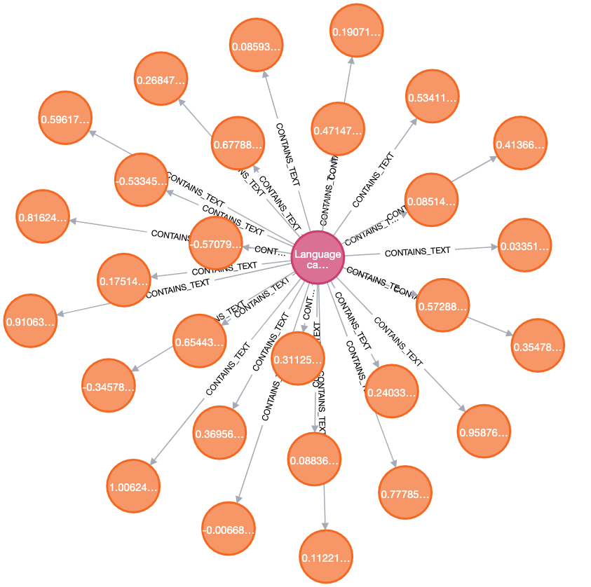
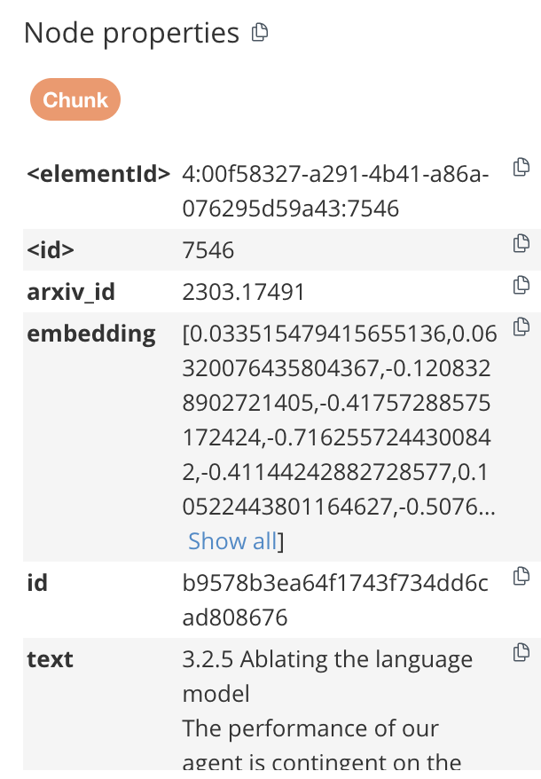
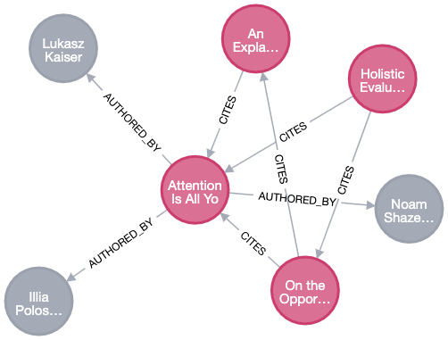
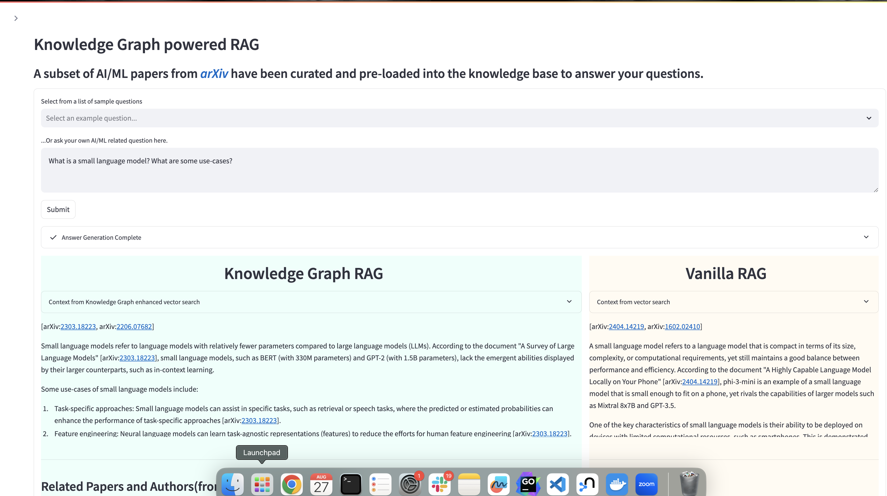
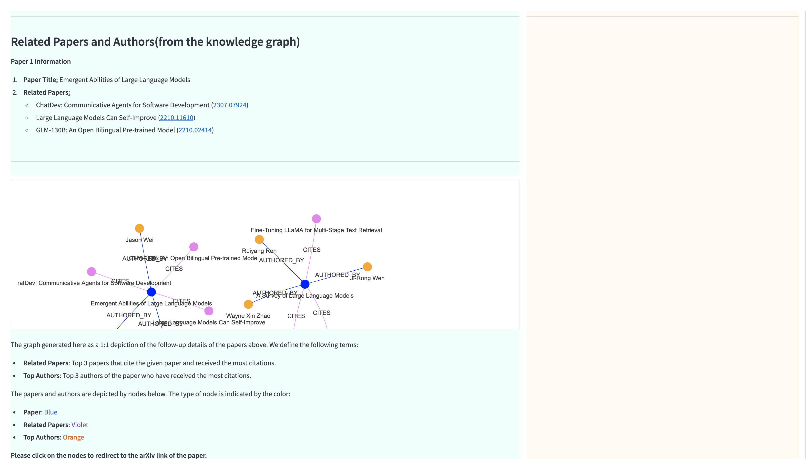
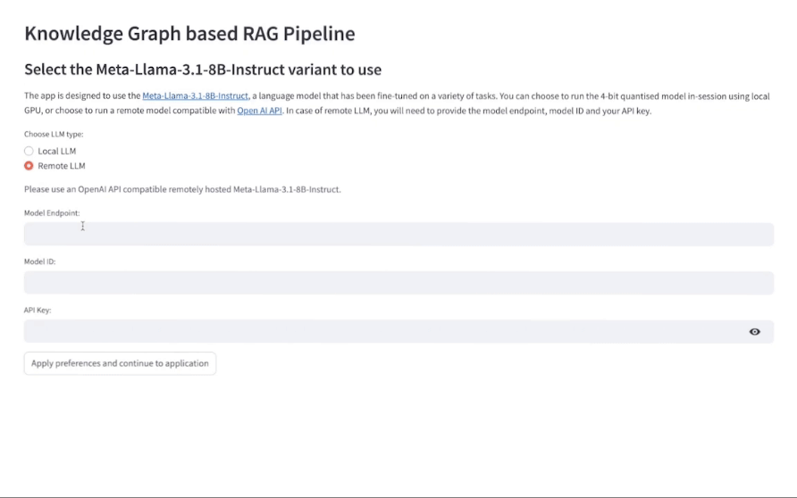
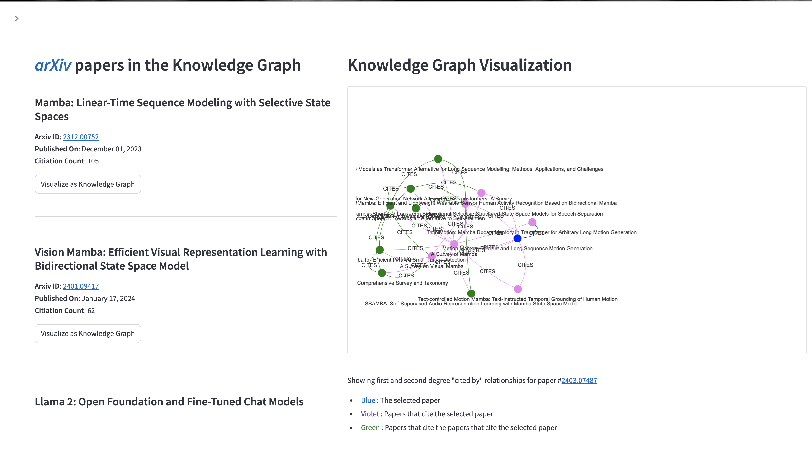

# Knowledge Graph powered RAG AMP

This repository demonstrates how to power a RAG(Retrieval Augmented Generation) application with a knowledge graph(supported by graph DBs like [Neo4j](https://neo4j.com/)) to capture relationships and contexts not easily accessible if vector databases are being used in a RAG pipeline

**IMPORTANT**: *Please read the following before proceeding. This AMP includes or otherwise depends on certain third party software packages. Information about such third party software packages are made available in the notice file associated with this AMP. By configuring and launching this AMP, you will cause such third party software packages to be downloaded and installed into your environment, in some instances, from third parties' websites. For each third party software package, please see the notice file and the applicable websites for more information, including the applicable license terms. If you do not wish to download and install the third party software packages, do not configure, launch or otherwise use this AMP. By configuring, launching or otherwise using the AMP, you acknowledge the foregoing statement and agree that Cloudera is not responsible or liable in any way for the third party software packages.*

## AMP Overview

In this AMP, we create a corpus of significant AI/ML papers from [arXiv](https://arxiv.org/), and from first degree citations of a few hardcoded seed papers, resulting in a database of ~350 papers. We expect that these papers would contain some informaton about the latest developments in Artificial Intelligence/Machine Learning/Large Language Models. The AMP user can ask AI/ML related questions, and the RAG pipeline would try to generate answers from the corpus stored in the database.

The AMP is powered by Knowledge Graph(backed by [Neo4j](https://neo4j.com/) Database in our case).

Integration of knowledge graph in this RAG pipeline aims to acheive two things:
 - Retrieve better quality text chunks by employing a hybrid retrieval strategy to pass on the LLM as context. In traditional retrieval methods, a vector embedding is calculated for an user input, and chunks are retrieved from a vector database(based on cosine similarity). We will employ a reranking methodology using information from knowledge graph to "rerank" the chunks retrieved using vector similarity, and pass the top **k** chunks as context.
 - Enhance the answer by giving auxillary information about the papers used to construct the answer, give recommendation about other related papers and top authors to the user.

The AMP is designed to run on and expects [Meta-Llama-3.1-8B-Instruct](https://huggingface.co/meta-llama/Meta-Llama-3.1-8B-Instruct) LLM as the backend. The AMP can leverage both remotely hosted LLM (Model URL, ID and API key needs to be passed) or locally(in-session) running LLM. In case of "local" LLM, the AMP is designed to run a 4-bit pre-quantized `Meta-Llama-3.1-8B-Instruct` model(It is pre-quantised as part of AMP steps, no manual intervention required).

## AMP Setup

### Configurable Options

**HF_TOKEN** : The AMP relies on [Huggingface Token](https://huggingface.co/docs/hub/en/security-tokens) to pull [meta-llama/Meta-Llama-3-8B-Instruct](https://huggingface.co/meta-llama/Meta-Llama-3-8B-Instruct) model from HuggingFace.

***Note***: Please make sure that the account associated with the HuggingFace token has access to the abovementioned model. It does require filling up a form to obtain access.

## AMP Concepts

Let's quickly go through some terminologies we would use throughout the AMP.

### Knowledge Graph

Knowledge graphs (KGs) organise data from multiple sources, capture information about entities of interest in a given domain or task (like people, places or events), and forge connections between them. In data science and AI, knowledge graphs are commonly used to:

 - Facilitate access to and integration of data sources.
 - Add context and depth to other, more data-driven AI techniques such as machine learning
 - Serve as bridges between humans and systems, such as generating human-readable explanations, or, on a bigger scale, enabling intelligent systems for scientists and engineers. 

An example KG from the AMP showing a paper, the categories the paper belongs to, its authors and other citing papers.

### Semantic Search

Semantic search is a search engine technology that interprets the meaning of words and phrases. The results of a semantic search will return content matching the meaning of a query, as opposed to content that literally matches words in the query.

**Vector Search** is a method for doing semantic search, used heavily in RAG pipelines. Vector search in a RAG context follows a series of steps:
 - We already have a corpus of text and their corresponding [vector embeddings](https://www.elastic.co/what-is/vector-embedding) stored in the database.
 - The vector embedding of the user query is calculated.
 - A vector similarity search is performed accross the database using a calculated embedding as the referance and top *k* results are retreived.

A simple diagram showing the flow of a vector search. Credits: [Elasticsearch B.V.](https://www.elastic.co/what-is/vector-embedding)

### Vector Databases

Vector databases store the vector embedding of a content(chunk of text, sound or image) along with some corresponding metedata for the content.

 - Vector databases offer well-known and easy-to-use features for data storage, like inserting, deleting, and updating data.
 - Vector databases have specialized capability to perform vector similarity search to retreive vector embeddings stored in the database along with the associated content based off some well known similarity metrics(Cosine similarity, or KNN).

*Note*: In our AMP, the Graph Database (Neo4j) also acts as vector database and have vector similarity search capabilities, thanks to [Graph Data Science(GDS)](https://github.com/neo4j/graph-data-science) plugin.

The diagrams show how chunks are connected to their source paper in the knowledge graph. Each chunk holds the text and the precomputed embedding of the text.

### Retrieval Augmented Generation (RAG)

Retrieval-augmented generation (RAG) is a technique for enhancing the accuracy and reliability of generative AI models with facts fetched from external sources.

Steps involvded in a RAG pipeline (Ref:[Langchain](https://blog.langchain.dev/tutorial-chatgpt-over-your-data/)):
 - Ingestion of Data
   - Load data sources into text
   - Chunk the text: This is necessary because language models generally have a limit to the amount of text they can deal with, so creating as small chunks of text as possible is necessary.
   - Embed text: this involves creating a numerical embedding for each chunk of text. 
   - Load embeddings to vectorstore: this involves putting embeddings and documents into a vectorstore(Native vector database or graph database in our case).
   - 
 - Querying of Data
   - Calculate vector embedding of the user query.
   - Lookup relevant documents: Using the embedding and vectorstore created during ingestion, we can look up relevant documents for the answer
   - Generate a response: Given the user query and the relevant documents as context, we can use a language model to generate a response.
   - 

### Re-Ranking

Reranking is a part of two-stage retreival systems where:
 1. Using vector databases and embedding model, we retrieve a set of relevant documents.
 2. Reranker model is used to "rerank" the documents retrieved in the first stage, and then we cut-off the context at top `k` results.

#### [ColBERT](https://github.com/stanford-futuredata/ColBERT) based Reranking

ColBERT encodes each passage into a matrix of token-level embeddings. Then at search time, it embeds every query into another matrix and efficiently finds passages that contextually match the query using scalable vector-similarity (`MaxSim`) operators.
Each passage(or chunk) is assgined a ColBERT score based upon similarity to the user query, and the score can be used to "rerank" chunks retrieved by vector search.

## How does Knowledge Graph fit in our AMP?

We leverage KG in two ways in order to make this RAG system better than plain(vanilla) RAG:
 1. We aim to enhance the quality of context retreived by choosing chunks from relatively "high-quality" papers.
 2. Provide additional information about the papers used to answer a certain question, which could have been more complex in case of traditional vector databases.

### Knowledge Graph RAG

Since we have a small but related set of AI/ML papers, there would be a lot of "citation" relationships between papers. We define a paper to be of **"Higher Quality"** if it has more number of citations. The number of citations can be computed for a specific paper from the knowledge graph that we have built.

We employ a "hybrid" strategy to retrieve chunks where we take into consideration the semantic similarity as well as the "quality" of the paper the chunk is coming from, before passing it to LLM as context.

#### Hybrid retrieval algorithm for top `k` chunks:
 1. Retrieve `4*k` chunks using vector similarity(to the user query) from the Database.
 2. Rerank the chunks using [ColBERT](#colbert-based-reranking), cut-off the number of chunks at `2*k`. Store the **ColBERT Score** as well.
 3. Calculate a **hybrid score** = `(normalized ColBERT score) + (normalised number of citations to the chunk's paper)`. Rerank again based on the hybrid score, and pick top `k` chunks as context.

### Additional Information for Papers Used

We instruct the LLM to provide us the [arXiv IDs](https://info.arxiv.org/help/arxiv_identifier.html) of the chunks used. We then use the arXiv IDs to extract some additional information about the papers so that user can search more about them. Retrieval of additional information have been made easy by graph databases, which could have been quite tricky in case of tradional vector databases. The information is then passed to the LLM for proper formatting of the response. Some of the information retrieved are:

 - Paper Title
 - Related Papers: Top 3 most cited papers which also cite the paper in question. Knowledge graph helps in capturing this information.
 - Top Authors: Top 3 most cited authors of the paper in question.
 - Summary: Summary of the paper's abstract in two lines.

The image shows "Top Authors" & "Related Papers" for the "Attention Is All You Need" paper.

## Knowledge Graph Construction

 - We start off with some predefined(seed) AI/ML papers as mentioned in [constants.py](./utils/constants.py)
 - The arXiv papers cited by the "seed" papers are extracted by converted the paper PDFs to text and matching with regex pattern to extract the arXiv IDs of the papers mentioned. This step results in ~600 uniques papers in our knowledge base.
 - For each of these papers, we download the PDF, extract chunks out of the PDF text, calculate vector embedding in save in the graph database.
 - The citation information is then captured in relationships between "Paper" nodes. The "Chunk" nodes are also linked to the papers they are coming from.

The image shows the paper #[2403.20183](https://arxiv.org/abs/2403.20183v3) with citations, authors, and the chunks(represented as yellow nodes) as part of the Knowledge Graph.

## AMP Flow

 1. In the first page, we can ask the application any AI/ML related questions and it will try to answer from the existing knowledge base that the application has. It will produce answers for the question using Knowledge Graph powered context retrieval and context retrieval just using vector search. The application will output:
    - Context used for both Knowledge Graph RAG and Vanilla RAG.
    - The answers synthesized by LLM using the context for both RAGs.
    - Related papers and top authors for the papers used to construct the answer in case of Knowledge Graph RAG.
    - A graphical representation of related papers and top authors.
  

  2. Although the application uses an in-session 4-bit quantised flavor of [Meta-Llama-3.1-8B-Instruct](https://huggingface.co/meta-llama/Meta-Llama-3.1-8B-Instruct), we can use a remotely hosted Llama3/3.1 model to power the application. The second page gives option to switch to remote LLM. There are various providers offering free tier API usage like [OpenRouter](https://openrouter.ai/models/meta-llama/llama-3.1-8b-instruct:free). Alternatively, you can also use Llama 3.1 hosted on **Cloudera AI Inference** service which has been [tech previewed](https://blog.cloudera.com/cloudera-introduces-ai-inference-service-with-nvidia-nim/).
  

  3. The third page gives an list of all papers contained in the knowledge-base. We can select any of these papers and graphically visualize the first and second order "cited by" relationships from other other papers.
  

## AMP Requirements

### CPU
 - CML CPU workloads with resource profiles up to **(2 vCPU/16 GiB memory)** would be provisioned.
 - **Additional resource of (1 vCPU/4 GiB)** memory would be requested to run Neo4j graph DB instance. There is no requirement of GPU enabled node here, can it may be scheduled on CPU-only node as well.

### GPU
 - Nvidia GPU with 16GB vRAM is required at minimum(to run both the embedding model & quantized LLM).
   - Tested with Nvidia Tesla T4 GPU (AWS: [g4dn series](https://aws.amazon.com/ec2/instance-types/g4/), Azure: [Standard_NC4as_T4_v3](https://learn.microsoft.com/en-us/azure/virtual-machines/nct4-v3-series))

### CML Runtime
 - PBJ-Workbench - Python3.10 - Nvidia GPU - 2023.05
